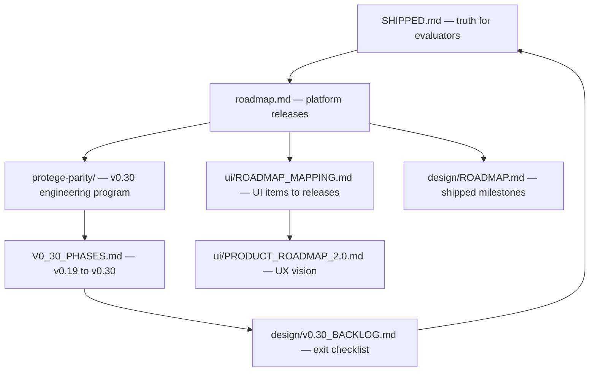

# Roadmap hub

Strixonomy IDE and Strixonomy engine publish several roadmap documents. **Use this page to pick the right one** — they serve different audiences and must not be read as a single capability list.

**Current tagged release:** v0.28.0 · **In development on `main`:** v0.28.0 · [What ships today](SHIPPED.md)

Development on `main` may be ahead of the tagged pin — follow [`docs/TAGGED_RELEASE`](https://github.com/eddiethedean/strixonomy/blob/main/docs/TAGGED_RELEASE) for install versions.

## Which document should I read?

| I want to… | Read this |
|------------|-----------|
| See **what ships today** | [What ships today](SHIPPED.md) — canonical capability matrix |
| Learn **canonical terminology** | [Glossary](glossary.md) |
| **Implement** OntoUI / workspaces (v0.13–v0.14) | [Platform overview](https://github.com/eddiethedean/strixonomy/blob/main/docs/platform/OVERVIEW.md) · [Plugin authoring](guides/plugins.md) · [Cursor prompts](https://github.com/eddiethedean/strixonomy/blob/main/docs/cursor-prompts/README.md) |
| **Implement Protégé parity** (v0.20–v0.30 next) | [Protégé parity program](https://github.com/eddiethedean/strixonomy/blob/main/docs/protege-parity/README.md) · [v0.29–v0.30 phases](https://github.com/eddiethedean/strixonomy/blob/main/docs/protege-parity/07_BACKLOG/V0_30_PHASES.md) · [Execution order](https://github.com/eddiethedean/strixonomy/blob/main/docs/protege-parity/05_IMPLEMENTATION/EXECUTION_ORDER.md) |
| See **what ships today** (one screen) | [Roadmap summary](roadmap-summary.md) — evaluator-friendly |
| Understand **platform direction** (full detail) | [Platform roadmap (full)](roadmap.md) in Contribute · [ROADMAP.md on GitHub](https://github.com/eddiethedean/strixonomy/blob/main/ROADMAP.md) |
| Map **UI design specs** to release phases | [UI roadmap mapping](https://github.com/eddiethedean/strixonomy/blob/main/docs/ui/ROADMAP_MAPPING.md) — master checklist |
| See **UI phases with milestones** | [Product Roadmap 2.0](https://github.com/eddiethedean/strixonomy/blob/main/docs/ui/PRODUCT_ROADMAP_2.0.md) |
| Read **product/platform ADRs** | [adr/README.md](adr/README.md) |
| Review **shipped engineering milestones** (v0.1–v0.11 detail) | [Design milestones](design/ROADMAP.md) |
| Track **v0.30 exit criteria** (contributor backlog) | [v0.29–v0.30 phases](https://github.com/eddiethedean/strixonomy/blob/main/docs/protege-parity/07_BACKLOG/V0_30_PHASES.md) · [v0.30 backlog](design/v0.30_BACKLOG.md) — not a shipped feature list |

## How they relate

## Rules of thumb

1. **Evaluators and new users:** start at [SHIPPED.md](SHIPPED.md), not a roadmap or UI spec.
2. **UI specs under `docs/ui/`** describe target UX — many items are planned for v0.30+. Cross-check [ROADMAP_MAPPING.md](https://github.com/eddiethedean/strixonomy/blob/main/docs/ui/ROADMAP_MAPPING.md) (v0.13–v0.14 foundation items shipped).
3. **Unchecked boxes** in [v0.30 backlog](design/v0.30_BACKLOG.md) mean "v0.30 exit bar" — not "missing today."
4. **Release timeline** for procurement: [Release timeline](guides/release-timeline.md) (non-commitment disclaimer applies).

## Current release

**v0.28.0** — see [Migration v0.24.0 → v0.28.0](migration/v0.26.md), [Migration v0.23.0 → v0.24.0](migration/v0.24.md), and [Changelog](changelog.md).

> **Design docs under `docs/platform/`, `docs/ui/`, `docs/protege-parity/`, and `docs/PROTEGE_REVERSE_ENGINEERING/` are not a shipped feature list.** Evaluators and procurement should use [SHIPPED.md](SHIPPED.md) and [Known limitations](known-limitations.md) only — ignore internal parity percentage assessments on GitHub.
