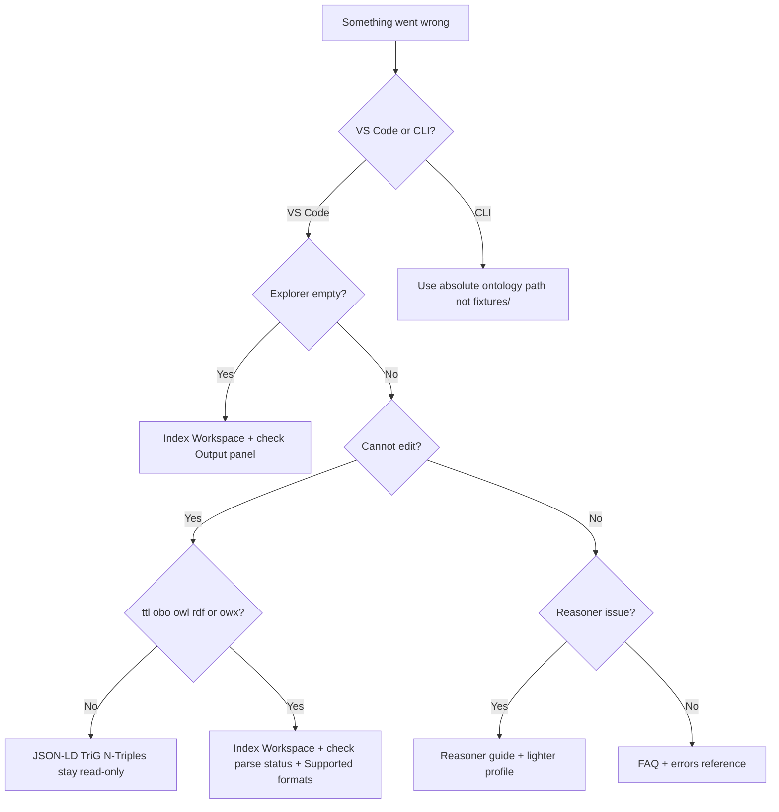

# Troubleshooting

Common problems and fixes for Strixonomy (VS Code) and Strixonomy (CLI/LSP).

For quick answers, see also [FAQ](faq.md).

## Where to start (symptom → guide)

| Symptom | Likely cause | Read first |
|---------|--------------|------------|
| Explorer empty or stale | Not indexed, wrong folder, unsupported format | [Explorer empty](#vs-code-explorer-empty-or-stale) |
| Language server failed to start | Untrusted workspace, bad `lspPath`, duplicate extension | [LSP failed](#vs-code-language-server-failed-to-start) |
| Cannot edit in inspector | Unsupported format (JSON-LD / TriG / N-Triples), parse error, or XML op outside first-cut set | [Cannot edit](#vs-code-cannot-edit-in-inspector) · [Supported formats](supported-formats.md) |
| Patch / Manchester did not stick | Buffer vs disk conflict, stale index | [Patch did not stick](#vs-code-patch-or-manchester-apply-did-not-stick) |
| `cargo install` / `strixonomy: command not found` after install | PATH, wrong version pin, docs ahead of release | [Install / version pin](#cli-install-or-version-not-found) · [Install CLI](guides/install-cli.md) |
| `validate` exits non-zero | Diagnostic errors in ontology | [Validate exit](#cli-validate-exits-non-zero) |
| Query returns no rows | Stale index, wrong table/column names | [Query empty](#queries-return-no-rows-or-wrong-data) |
| Reasoner errors or empty hierarchy | Profile mismatch, Ontologos, unsat classes | [Reasoner](#reasoner) |
| Cannot edit `.obo` | Pre-v0.13 extension or term not in `.obo` file | [Graphs, OBO, ROBOT](#graphs-obo-robot-and-semantic-diff) |
| Semantic diff / graph missing | No git repo, not indexed | [Graphs, OBO, ROBOT](#graphs-obo-robot-and-semantic-diff) |
| Inspector and graph show different entities | Panels opened before v0.13 or focus relay disabled | Re-open panels; click entity in explorer — [migration v0.13](migration/v0.13.md) |
| Schema browser empty in Query Workbench | Workspace not indexed or SPARQL mode selected | Index workspace; switch to catalog SQL mode — [Query Workbench](ide/query-workbench.md) |
| XML edit rewrote layout / unsupported op | Semantic re-serialize (expected); check supported XML patch ops | [OWL/XML write-back](guides/owl-xml-workflow.md) |

Need help beyond this page? See [Support and contact](support.md).



## VS Code: explorer empty or stale

1. Run **Strixonomy: Index Workspace** from the Command Palette.
2. Check **View → Output → Strixonomy Language Server** for errors.
3. Confirm the folder contains supported files (`.ttl`, `.obo`, `.owl`, `.rdf`, `.jsonld`, `.nt`, `.nq`, `.trig`).
4. **Multi-root workspace:** since v0.10 all folders are indexed — confirm each root contains ontology files and check **Output → Strixonomy Language Server** for per-root errors.

## VS Code: language server failed to start

1. Check **Output → Strixonomy Language Server** for the exact error.
2. Uninstall duplicate Strixonomy extension versions.
3. Strixonomy’s **bundled** language server works in trusted and Restricted Mode. **Do not Trust the workspace** unless you configured `strixonomy.lspPath` or `strixonomy.robotPath` (Restricted Mode ignores those settings).
4. Set `strixonomy.lspPath` to a local `strixonomy-lsp` binary (`cargo install ontocore-lsp --locked --version 0.27.0`) — trusted workspaces only.
5. See [Install VS Code](vscode-install.md#troubleshooting).

## VS Code: cannot edit in inspector

- Write-back applies to **Turtle (`.ttl`), OBO (`.obo`), RDF/XML (`.owl`/`.rdf`), and OWL/XML (`.owx`)** (v0.21+). See [Supported formats](supported-formats.md). JSON-LD and line-oriented RDF are read-only. XML is semantic re-serialize — [OWL/XML write-back](guides/owl-xml-workflow.md).
- Entity must be declared in an indexed editable file (`.ttl`, `.obo`, `.owl`/`.rdf`, or `.owx`) in the workspace.
- See [OBO authoring](ide/obo-authoring.md) and [OWL/XML write-back](guides/owl-xml-workflow.md).

## VS Code: patch or Manchester apply did not stick

Patches write the **source file on disk** first (`.ttl`, `.obo`, `.owl`/`.rdf`, or `.owx`), then update the language server’s open-buffer copy. XML formats are **semantic re-serialize** — see [OWL/XML and RDF/XML write-back](guides/owl-xml-workflow.md):

1. If the editor still shows old text, accept or re-apply the workspace edit, or reload the file from disk.
2. If you had **unsaved** local edits that conflicted, review the file on disk — the server applied against its buffer/disk snapshot.
3. If re-index fails after a successful write, the catalog may be stale. Run **Strixonomy: Index Workspace**.
4. Check **View → Output → Strixonomy Language Server** and [errors reference](errors.md).

## CLI: install or version not found

**Symptom:** `cargo install strixonomy-cli --locked --version X.Y.Z` fails with “could not find version” or GitHub Release curl returns 404.

**Cause:** Documentation on `main` may describe an **unreleased** minor while crates.io and GitHub Releases only publish **tagged** versions.

**Fix:**

1. Pin the latest tagged release from [docs/TAGGED_RELEASE](https://github.com/eddiethedean/strixonomy/blob/main/docs/TAGGED_RELEASE) (currently **0.27.0**):

   ```bash
   cargo install ontocore-cli --locked --version 0.27.0
   ```

2. For release tarballs, download assets from the matching tag (e.g. `v0.27.0`). Prefer the tagged release over docs that may preview a future minor on `main`.

3. Ensure Cargo’s bin directory is on your `PATH` — see [Install CLI](guides/install-cli.md).

Marketplace / Open VSX extension versions may lag a brand-new GitHub tag briefly — check the installed extension version in **Extensions**, or install the release VSIX from [GitHub Releases](https://github.com/eddiethedean/strixonomy/releases).

## CLI: `strixonomy query ./fixtures` fails

The `fixtures/` directory exists only in a **git clone**, not after `cargo install`:

```bash
strixonomy query /path/to/your/ontologies "SELECT * FROM classes"
```

## CLI: install and PATH

| Symptom | Fix |
|---------|-----|
| `strixonomy: command not found` after `cargo install` | **Unix/macOS:** add `$HOME/.cargo/bin` to `PATH`. **Windows (PowerShell):** `$env:Path += ";$env:USERPROFILE\.cargo\bin"` then open a new terminal — see [Install CLI](guides/install-cli.md) |
| `cargo install` fails with MSRV / edition error | Run `rustup update stable`; require Rust **1.88+** (`rustc --version`) |
| `cargo install` network / crates.io errors | Retry with `--locked`; pin `--version 0.27.0` in CI |
| Release tarball on macOS/Windows | CLI pre-builds are **Linux x64 only** — use `cargo install` or the VSIX extension |
| macOS Gatekeeper blocks bundled `strixonomy-lsp` | Prefer Marketplace install; for sideloaded VSIX see [VS Code install](vscode-install.md) (`xattr -d com.apple.quarantine` when needed) |
| Corporate Marketplace blocked / lag | Install `ontocode-v0.27.0.vsix` from [GitHub Releases](https://github.com/eddiethedean/strixonomy/releases) — [VS Code install](vscode-install.md) |
| `strixonomy diff HEAD..WORKTREE` fails | Run from a **git repository** root containing ontology files |

## CLI: `validate` exits non-zero

Exit code **0** only when there are no diagnostic **errors** (warnings are allowed). Query errors:

```bash
strixonomy query /path/to/ontologies "SELECT code, severity, message FROM diagnostics WHERE severity = 'error'"
```

See [CI integration](ci-integration.md).

## Queries return no rows or wrong data

1. Re-index: `strixonomy validate` or VS Code **Index Workspace**.
2. Confirm SQL table name and column names — [SQL reference](sql-reference.md).
3. SPARQL runs over indexed triples — prefix declarations must be valid in source files.

## Results truncated at 100,000 rows

Both SQL and SPARQL cap results at **100,000 rows** with silent truncation. In the Query Workbench or LSP responses, check `truncated: true`. Narrow your query with `WHERE` or SPARQL `LIMIT`.

See [workspace limits](workspace-limits.md).

## Patch JSON errors

| Symptom | Likely cause |
|---------|--------------|
| `entity not found` | Wrong IRI or entity not in target `.ttl` file; check `@prefix` declarations |
| `unsupported format` | Patch target is not Turtle (`.ttl`), OBO (`.obo`), RDF/XML (`.owl`/`.rdf`), or OWL/XML (`.owx`); JSON-LD / N-Triples / TriG remain read-only |
| `applied: false` with diagnostics | Invalid patch op or Manchester expression — see [patch reference](patch-reference.md) |

## Workspace too large

Indexing may fail above [workspace limits](workspace-limits.md) (file count, size, triple caps). For very large terminologies, use CLI batch workflows on a subset.

## Graphs, OBO, ROBOT, and semantic diff

| Problem | What to try |
|---------|-------------|
| Semantic diff: `no git repository` | Open a git checkout; or use CLI `strixonomy diff --left-ref ./a --right-ref ./b` |
| Semantic diff panel empty | Run **Index Workspace**; see [Semantic diff](ide/semantic-diff.md) |
| Graph commands missing | Run **Index Workspace** first — [Graph view](ide/graph-view.md) |
| Cannot edit `.obo` in inspector | Confirm Strixonomy **v0.13.0+**; entity must be in an indexed `.obo` file — [OBO guide](guides/obo-workflow.md) |
| `robot` not found | Install Java + ROBOT; set `strixonomy.robotPath` — [ROBOT guide](guides/robot-interop.md) |

## Reasoner

| Problem | What to try |
|---------|-------------|
| Reasoner command missing or greyed out | Run **Index Workspace** first; Trust only if using custom `lspPath` |
| `OntoLogos` / classify errors | Confirm ontology fits [workspace limits](workspace-limits.md); try lighter profile (`el`, `rl`, `rdfs`) |
| `dl` or `auto` profile fails | DL requires supported constructs; check Output panel; try `el` for EL-only ontologies; see [Reasoner guide](guides/reasoner.md) |
| Reasoner runs but no inferred edges | Run **Strixonomy: Run Reasoner**, then **Set Hierarchy Mode** → inferred or combined |
| Explanation panel empty | Explanations need an unsatisfiable class; run reasoner first; DL explanations require v0.12+ |
| Classify exits non-zero in CI | Ontology has unsatisfiable classes — inspect JSON `unsatisfiable` list |
| Reasoner timeout / hang | Large ontologies may exceed memory caps — subset or use `el` profile; see [Performance and sizing](guides/performance-sizing.md) |

See [Reasoner guide](guides/reasoner.md).

## Still stuck?

- [FAQ](faq.md)
- [Errors reference](errors.md)
- [Report an issue](https://github.com/eddiethedean/strixonomy/issues)
